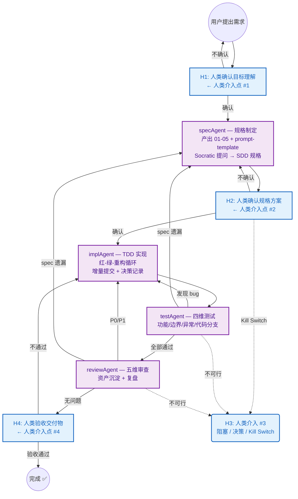
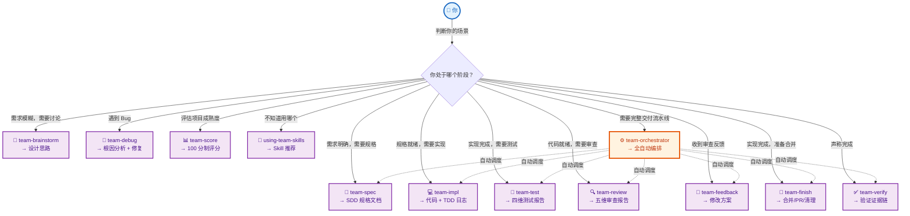

<div align="center">

# Team Skills

**让 AI Agent 团队像专业开发团队一样协作**

[](https://github.com/andeya/team-skills)
[](https://github.com/andeya/team-skills/actions)
[](LICENSE)
[](https://claude.ai)
[](https://cursor.sh)
[](CONTRIBUTING.md)
[](https://conventionalcommits.org)

**Spec-Driven · 有向图回退 · 质量门禁 · 100 分制评分**

</div>

---

## 🤔 你是否有过这些经历？

| 场景 | 传统做法 | 结果 |
|------|----------|------|
| 给 AI 一句话就写代码 | AI 产出随机，改 5 轮才接近需求 | ❌ 浪费时间 |
| AI 说"测试通过了" | 你相信了，结果 CI 全红 | ❌ 信任崩塌 |
| Review 发现 bug | 只能手动修，没有回退机制 | ❌ 重复劳动 |
| 换了 session 一切归零 | 规则不沉淀，每次从零开始 | ❌ 没有积累 |
| 不知道项目做得好不好 | 凭感觉判断 | ❌ 无法量化 |

**Team Skills 用工程化的方式解决了这些问题。**

---

## ✨ 为什么 Team Skills 与众不同？

### 🎯 Spec-Driven，不是 Chat-Driven

```
传统方式：用户 → AI（一句话）→ 代码（随机产出）
Team Skills：用户 → H1确认 → SDD规格 → H2确认 → TDD实现 → 测试 → Review → H4验收
```

每个环节有明确的输入/输出标准，AI 不是"猜需求"，而是**执行规格**。

### 🔄 有向图回退，不是线性流水线

```
testAgent 发现 bug ──→ 自动回退 implAgent
reviewAgent 发现 spec 遗漏 ──→ 自动回退 specAgent
同一阶段回退 ≤ 2 次，超过触发人类介入
```

**发现问题立即回退，不是"先记着后面修"**。

### 🛡️ 质量门禁，不是"我觉得"

- **5 步验证协议**：确定命令 → 新鲜执行 → 完整阅读 → 检查退出码 → 声明通过
- **8 条 Constitutional Rules**：不可覆盖的硬约束
- **反规避条款**：预判 6 种常见借口并逐一反驳
- **三视角对抗审查**：攻击者/怀疑者/用户视角反向验证

### 📊 100 分制评分，不是凭感觉

```
7 项硬门槛（任一不通过则整体不通过）
5 个维度 × 25 子项
每个子项有可检查的证据要求
```

---

## 🚀 30 秒快速开始

### 安装

```bash
# 在 Claude Code 中
/team-setup

# 在 Cursor 中，克隆项目后运行：
#   cd ~/.cursor/agents/skills/
#   ln -sf /path/to/team-skills/skills/* .
# 或直接执行 /team-setup（如已配置 Cursor 的 Claude CLI）
```

### 使用

```bash
# 全自动编排（推荐）
/team-orchestrator 实现用户登录功能

# 编排器自动完成：
#   1. H1: 向你确认目标理解
#   2. specAgent: 产出 SDD 规格
#   3. H2: 向你确认规格方案
#   4. implAgent: TDD 实现
#   5. testAgent: 四维测试
#   6. reviewAgent: 五维审查
#   7. H4: 向你交付验收

# 轻量模式（简单任务，跳过 H1/H2）
/team-orchestrator --light 修复登录页按钮样式
```

### 评分

```bash
/team-score
# 输出 100 分制评分报告 + 改进建议
```

---

## 🏗️ 核心架构



> H3 可在**任何阶段**触发，包括：发现任务不可行（Kill Switch）、回退超限、或需要人类决策的复杂问题。

---

## 🗺️ Skill 使用地图

> 从你的场景出发，找到对应的 Skill。实线是你主动调用，虚线是编排器自动调度。



**使用说明：**
- **实线箭头 →**：你主动调用某个 Skill，适合只做其中一步
- **虚线箭头 ⇢**：编排器自动调度，适合需要完整流水线
- 每个 Skill 下方标注了它的产出物

---

## 📦 包含 12 个可独立使用的 Skill

| Skill | 一句话说明 | 使用场景 |
|-------|-----------|----------|
| `team-brainstorm` | 需求模糊时讨论形成方案 | "这个功能怎么做？" |
| `team-spec` | 一句话需求展开为完整 SDD 规格 | "实现登录功能" |
| `team-impl` | TDD 红-绿-重构循环实现 | "规格有了，开始写代码" |
| `team-test` | 四维测试矩阵 + 补充测试 | "测试覆盖够吗？" |
| `team-review` | 五维审查 + 资产沉淀 + 复盘 | "代码质量如何？" |
| `team-orchestrator` | 有向图流程编排，4 个人类介入点 | "我要完整交付流水线" |
| `team-verify` | 5 步验证门禁，杜绝虚假通过 | "测试真的过了吗？" |
| `team-debug` | 四阶段根因分析 + 修复 | "这个 bug 怎么回事？" |
| `team-feedback` | 先验证再实施，非表演性同意 | "Review 反馈来了" |
| `team-finish` | 分支完成处理（合并/PR/保留/丢弃） | "代码写完了" |
| `team-score` | 100 分制扫描评估 | "项目协作成熟度如何？" |
| `using-team-skills` | Meta-skill，自动引导你选正确的 Skill | "我该用哪个？" |

> 每个 Skill 可独立使用，也可通过 `team-orchestrator` 串联成完整流水线。

---

## 📋 每个任务产出 17 个结构化文档

```
docs/tasks/{slug}/
├── 01-plan.md              # 任务规划（目标 + 分期 + 预算）
├── 02-context.md           # 上下文选择（术语 + 引用 + 排除）
├── 03-sdd.md               # SDD 规格（七部分完整）
├── 04-boundary.md          # 修改边界（allow + deny）
├── 05-risk.md              # 风险 + 验证计划
├── prompt-template.md      # AI 任务提示词模板
├── 06-tdd-log.md           # TDD 日志（红-绿-重构循环）
├── 07-prompt-log.md        # Prompt 工程记录（五要素 + 纠偏）
├── 08-ai-decisions.md      # AI 决策记录（选择 + 拒绝 + 理由）
├── 09-test-matrix.md       # 四维测试矩阵
├── 10-test-report.md       # 测试运行报告（证据链）
├── 11-review.md            # 代码审查报告（五维度 + 合规）
├── 12-asset-update.md      # 资产更新记录（消费方契约）
├── 13-retrospective.md     # 个人复盘（新规则沉淀）
├── task-rules.md           # 任务级规则
├── 14-team.md              # 团队协作记录
└── 15-brief.md             # 答辩提纲
```

---

## 🔧 兼容性

| 工具 | 调用方式 | 自动发现 |
|------|----------|----------|
| **Claude Code** | `/team-{name}` 斜杠命令 | `~/.claude/commands/` |
| **Cursor** | Skill 自动发现 | `~/.agents/skills/` |

---

## 📚 体系来源

Team Skills 融合了业界多个 AI 协作框架的精华：

| 来源 | 吸收的精华 |
|------|-----------|
| **SuperPowers** (obra) | 5 步验证协议、四态完成状态、反规避条款、Socratic 探索 |
| **OpenSpec** (Fission AI) | Delta Spec 增量规格、RFC 2119 + Given/When/Then |
| **Karpathy Skills** | 过度抽象防御、死代码清理、困惑管理 |
| **Agent-Style** | 5 条 LLM 输出质量约束 |
| **独创** | 有向图回退、评分追溯矩阵、消费方契约、H1-H4 人类介入点 |

---

## 🤝 贡献

欢迎贡献！请先阅读 [CONTRIBUTING.md](CONTRIBUTING.md)。

- 🐛 [报告 Bug](https://github.com/andeya/team-skills/issues/new?template=bug_report.md)
- 💡 [提出新功能](https://github.com/andeya/team-skills/issues/new?template=feature_request.md)
- 📖 [改进文档](https://github.com/andeya/team-skills/pulls)

---

<div align="center">

**如果 Team Skills 对你有帮助，请给一个 ⭐ — 让更多人看到工程化的 AI 协作方式。**

</div>
