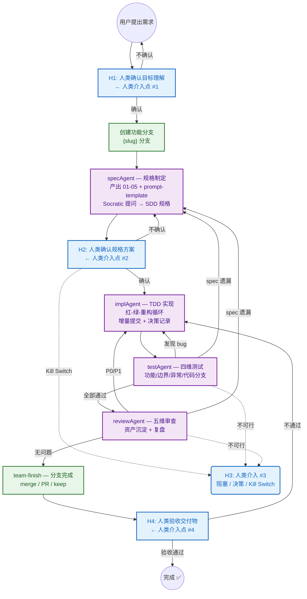
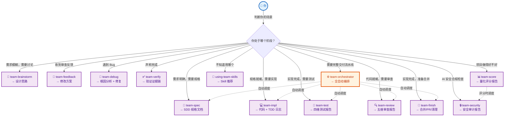

<div align="center">

# Team Skills

**让 AI Agent 团队像专业开发团队一样协作**

[](https://github.com/andeya/team-skills)
[](https://github.com/andeya/team-skills/actions)
[](LICENSE)
[](https://claude.ai)
[](https://cursor.sh)
[](CONTRIBUTING.md)
[](https://conventionalcommits.org)

**Spec-Driven · 有向图回退 · 质量门禁**

</div>

---

## 🤔 你是否有过这些经历？

| 场景 | 传统做法 | 结果 |
|------|----------|------|
| 给 AI 一句话就写代码 | AI 产出随机，改 5 轮才接近需求 | ❌ 浪费时间 |
| AI 说"测试通过了" | 你相信了，结果 CI 全红 | ❌ 信任崩塌 |
| Review 发现 bug | 只能手动修，没有回退机制 | ❌ 重复劳动 |
| 换了 session 一切归零 | 规则不沉淀，每次从零开始 | ❌ 没有积累 |
| 不知道项目做得好不好 | 凭感觉判断 | ❌ 无法量化 |

**Team Skills 用工程化的方式解决了这些问题。**

---

## ✨ 为什么 Team Skills 与众不同？

### 🎯 Spec-Driven，不是 Chat-Driven

```
传统方式：用户 → AI（一句话）→ 代码（随机产出）
Team Skills：用户 → H1确认 → SDD规格 → H2确认 → TDD实现 → 测试 → Review → H4验收
```

每个环节有明确的输入/输出标准，AI 不是"猜需求"，而是**执行规格**。

### 🔄 有向图回退，不是线性流水线

```
testAgent 发现 bug ──→ 自动回退 implAgent
reviewAgent 发现 spec 遗漏 ──→ 自动回退 specAgent
同一阶段回退 ≤ 2 次，超过触发人类介入
```

**发现问题立即回退，不是"先记着后面修"**。

### 🛡️ 质量门禁，不是"我觉得"

- **5 步验证协议**：确定命令 → 新鲜执行 → 完整阅读 → 检查退出码 → 声明通过
- **9 条 Constitutional Rules**：不可覆盖的硬约束
- **反规避条款**：预判 9 种常见借口并逐一反驳
- **三视角对抗审查**：攻击者/怀疑者/用户视角反向验证

### 📝 规则沉淀，不是"每次从零"

- **三层规则体系**：项目级 → 模块级 → 任务级，冲突按优先级覆盖
- **消费方契约**：每条规则含触发条件 + 可执行指令 + 示例，下游 Agent 可直接执行

### 📊 量化评估，不是"凭感觉"

- **7 硬门禁 + 24 评分项**：五维度 100 分制量化打分
- **反虚构规则**：占位符 >20% 或有效行 <10 → 判定 0 分

---

## 🚀 安装

### 前置条件

- **Node.js** >= 18
- **Claude Code** 或 **Cursor**：至少安装其中之一

### 一键安装（推荐）

```bash
npx team-skills@latest setup
```

自动将 Skills、斜杠命令和 Hooks 以 symlink 方式安装到全局目录。

启用可选的项目评分功能（`team-score`）：

```bash
npx team-skills@latest setup --with-score
```

全局安装后可直接在终端调用：

```bash
npm i -g team-skills
team-skills setup
```

### 初始化到项目（可选）

将 Skills 复制到项目中，支持版本控制和自定义：

```bash
npx team-skills@latest init
# 含评分功能
npx team-skills@latest init --with-score
```

自动检测项目中的 `.claude/` 和 `.cursor/` 目录，将对应文件复制到 IDE 能发现的位置。后续更新：

```bash
npx team-skills@latest update
```

> **提示**：Hooks 仅在全局安装（`setup`）模式下生效，`init` 不安装 hooks。

### 安装内容

| 内容 | 位置 | 说明 |
|------|------|------|
| 13 个 Agent Skills | `~/.agents/skills/` | Cursor 自动发现（team-score 需 `--with-score`） |
| 13 个 Skill 斜杠命令 | `~/.claude/commands/` | Claude Code `/team-{name}` |
| 共享规则 | `~/.agents/skills/_team-rules/` | 被所有 Skill 引用 |
| CLI 辅助命令 | 两端均安装 | team-setup/uninstall/pull/push |
| Hooks（可选） | `~/.cursor/hooks/` | session-start 自动加载 |

### 验证

```bash
# 在 Claude Code / Cursor 中输入 / 查看 team- 开头的命令
/using-team-skills
```

### CLI 参考

| 命令 | 说明 | 关键选项 |
|------|------|----------|
| `team-skills setup` | symlink 安装到全局目录 | `--with-score` `--no-hooks` `--force` |
| `team-skills init [dir]` | 复制到项目 IDE 目录 | `--ide <claude\|cursor\|both>` `--with-score` |
| `team-skills update [dir]` | 升级包 + 更新项目副本 | `--skip-self` `--ide` `--with-score` |
| `team-skills uninstall` | 移除所有全局 symlink | `--no-hooks` `--no-commands` |
| `team-skills list` | 查看全局安装状态 | `--json` |

所有命令支持 `--dry-run`。

---

## 📖 使用方式

### 全自动编排（推荐）

一条命令启动完整流水线，适合从零开始的功能开发：

```bash
/team-orchestrator 实现用户登录功能
```

编排器自动完成：H1 确认目标 → specAgent 产出 SDD → H2 确认规格 → implAgent TDD 实现 → testAgent 四维测试 → reviewAgent 五维审查 → 分支完成处理 → H4 验收交付

简单任务可用精简模式：

```bash
/team-orchestrator --compact 修复登录页按钮样式
```

### 按需调用单个 Skill

| 场景 | 命令 |
|------|------|
| 需求模糊，需要讨论 | `/team-brainstorm 这个功能怎么做？` |
| 一句话需求展开为规格 | `/team-spec 实现登录功能` |
| 已有规格，开始编码 | `/team-impl` |
| 测试覆盖够吗？ | `/team-test` |
| 代码质量如何？ | `/team-review` |
| Review 反馈来了 | `/team-feedback` |
| 这个 bug 怎么回事？ | `/team-debug` |
| 测试真的过了吗？ | `/team-verify` |
| 代码写完了 | `/team-finish` |
| AI 安全合规检查 | `/team-security` |
| 项目做得好不好？ | `/team-score` |
| 不知道用哪个 | `/using-team-skills` |

---

## 🏗️ 核心架构



> H3 可在**任何阶段**触发，包括：发现任务不可行（Kill Switch）、回退超限、或需要人类决策的复杂问题。
> 功能分支在 H1 确认后自动创建，在 Review 通过后由 team-finish 处理（merge/PR/keep/discard）。

---

## 🗺️ Skill 使用地图

> 从你的场景出发，找到对应的 Skill。



> 实线 = 你主动调用；虚线 = 编排器自动调度。每个节点下方标注了产出物。

---

## 📦 包含 13 个可独立使用的 Skill

| Skill | 一句话说明 | 使用场景 |
|-------|-----------|----------|
| `team-brainstorm` | 需求模糊时讨论形成方案 | "这个功能怎么做？" |
| `team-spec` | 一句话需求展开为完整 SDD 规格 | "实现登录功能" |
| `team-impl` | TDD 红-绿-重构循环实现 | "规格有了，开始写代码" |
| `team-test` | 四维测试矩阵 + 补充测试 | "测试覆盖够吗？" |
| `team-review` | 五维审查 + 资产沉淀 + 复盘 | "代码质量如何？" |
| `team-feedback` | 先验证再实施，非表演性同意 | "Review 反馈来了" |
| `team-debug` | 四阶段根因分析 + 修复 | "这个 bug 怎么回事？" |
| `team-verify` | 5 步验证门禁，杜绝虚假通过 | "测试真的过了吗？" |
| `team-finish` | 分支完成处理（合并/PR/保留/丢弃） | "代码写完了" |
| `team-orchestrator` | 有向图流程编排 + 分支管理，4 个人类介入点 | "我要完整交付流水线" |
| `team-score` | 7 硬门禁 + 24 项五维度评分（100 分制） | "项目做得好不好？" |
| `team-security` | AI 安全红线合规检查（6+4 红线 + 6 场景） | "AI 使用安全吗？" |
| `using-team-skills` | Meta-skill，自动引导你选正确的 Skill | "我该用哪个？" |

> 每个 Skill 可独立使用，也可通过 `team-orchestrator` 串联成完整流水线。`team-score` 和 `team-security` 为可选评估工具，安装时需 `--with-score`。

---

## 📋 结构化文档体系

团队协作过程中产出的所有文档，统一存放在 `docs/` 目录下：

```
docs/
├── tasks/                          # 任务文档（核心目录）
│   ├── progress.md                 # 进度账本 — 所有任务的状态追踪表
│   │
│   ├── {NNNN}-{keyword}/           # 单个任务目录（最多产出 18 个结构化文档）
│   │   ├── 00-design-brief.md      #   设计概要（team-brainstorm 产出，可选）
│   │   ├── 01-plan.md              #   任务规划（目标 + 分期 + 预算）
│   │   ├── 02-context.md           #   上下文选择（术语 + 引用 + 排除）
│   │   ├── 03-sdd.md              #   SDD 规格（七部分完整）
│   │   ├── 04-boundary.md          #   修改边界（allow + deny）
│   │   ├── 05-risk.md              #   风险 + 验证计划
│   │   ├── prompt-template.md      #   AI 任务提示词模板
│   │   ├── 06-tdd-log.md           #   TDD 日志（红-绿-重构循环）
│   │   ├── 07-prompt-log.md        #   Prompt 工程记录（五要素 + 纠偏）
│   │   ├── 08-ai-decisions.md      #   AI 决策记录（选择 + 拒绝 + 理由）
│   │   ├── 09-test-matrix.md       #   四维测试矩阵
│   │   ├── 10-test-report.md       #   测试运行报告（证据链）
│   │   ├── 11-review.md            #   代码审查报告（五维度 + 合规）
│   │   ├── 12-asset-update.md      #   资产更新记录（消费方契约）
│   │   ├── 13-retrospective.md     #   个人复盘（新规则沉淀）
│   │   ├── task-rules.md           #   任务级规则
│   │   ├── 14-team.md              #   团队协作记录
│   │   └── 15-brief.md             #   答辩提纲
│   │
│   └── ...                         # 更多任务目录
│
├── review-checklist.md             # Review 检查清单（项目级，跨任务累积）
├── delivery-checklist.md           # 交付检查清单（项目级，跨任务累积）
├── security-audit.md               # AI 安全红线合规审计报告（team-security 产出）
└── specs/                          # SDD 归档（任务验收通过后存档）
```

### 文档职责分层

| 层级 | 目录 | 生命周期 | 说明 |
|------|------|----------|------|
| **进度追踪** | `tasks/progress.md` | 持续更新 | 防止跨 session 任务重复派发，记录所有任务状态 |
| **任务文档** | `tasks/{slug}/` | 随任务创建 | 每个任务独立目录，slug 格式 `{NNNN}-{keyword}` |
| **项目级清单** | `review-checklist.md` | 跨任务累积 | 每次 Review 发现新检查项后追加，持续积累 |
| **项目级清单** | `delivery-checklist.md` | 跨任务累积 | 每次交付发现新检查项后追加，持续积累 |
| **安全审计** | `security-audit.md` | 每次重写 | team-security 产出的 AI 安全红线合规审计报告 |
| **规格归档** | `specs/` | 验收后存档 | SDD 快照归档，供后续任务参考 |

### 任务文档产出阶段

| 阶段 | 产出文件 | 负责 Skill |
|------|----------|------------|
| 头脑风暴 | `00-design-brief.md` | `team-brainstorm` |
| 规格设计 | `01-plan.md` ~ `05-risk.md` + `prompt-template.md` | `team-spec` |
| TDD 实现 | `06-tdd-log.md` ~ `08-ai-decisions.md` | `team-impl` |
| 测试审计 | `09-test-matrix.md` ~ `10-test-report.md` | `team-test` |
| 代码审查 | `11-review.md` ~ `13-retrospective.md` + `task-rules.md` | `team-review` |
| 安全审计 | `docs/security-audit.md` | `team-security` |
| 团队交付 | `14-team.md` + `15-brief.md` | `team-orchestrator` |

---

## 📚 体系来源

Team Skills 融合了业界多个 AI 协作框架的精华：

| 来源 | 吸收的精华 |
|------|-----------|
| **SuperPowers** (obra) | 5 步验证协议、四态完成状态、反规避条款、Socratic 探索 |
| **OpenSpec** (Fission AI) | Delta Spec 增量规格、RFC 2119 + Given/When/Then |
| **Karpathy Skills** | 过度抽象防御、死代码清理、困惑管理 |
| **Agent-Style** | 5 条 LLM 输出质量约束 |
| **独创** | 有向图回退、质量追溯矩阵、消费方契约、H1-H4 人类介入点、100 分制量化评估、Markdown Skill Language |

---

## 🔧 本地开发

```bash
git clone https://github.com/andeya/team-skills.git
cd team-skills
npm install
```

### 开发命令

```bash
npm run lint       # 检查 Markdown 格式 + Skill 结构完整性（CI 同款）
npm run format     # 自动修复 Markdown 格式
npm run cli-test   # CLI 冒烟测试
npm run setup      # 安装 Skills 到全局目录
```

### Skill 编写规范

编写或修改 Skill 时，请参考 `skills/_team-rules/skill-spec.md`（Markdown Skill Language v1.0 形式语法）。

### CI 流程

提交后 GitHub Actions 自动运行：

| Workflow | Job | 说明 |
|----------|-----|------|
| CI | Lint | Markdown 格式 + Skill 结构检查 |
| CI | CLI Smoke Test | CLI 功能验证 |
| CI | Check Links | 外部链接有效性 |
| Release | Publish to npm | `v*` tag 触发，自动发布到 npm |

---

## 🤝 贡献

欢迎贡献！请先阅读 [CONTRIBUTING.md](CONTRIBUTING.md)。

- 🐛 [报告 Bug](https://github.com/andeya/team-skills/issues/new?template=bug_report.md)
- 💡 [提出新功能](https://github.com/andeya/team-skills/issues/new?template=feature_request.md)
- 📖 [改进文档](https://github.com/andeya/team-skills/pulls)

---

<div align="center">

**如果 Team Skills 对你有帮助，请给一个 ⭐ — 让更多人看到工程化的 AI 协作方式。**

</div>
